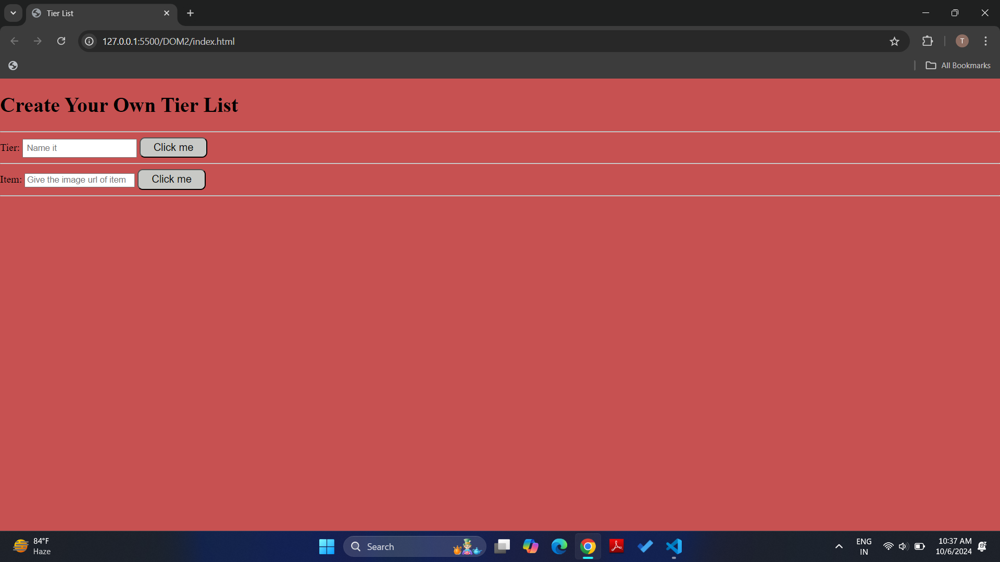
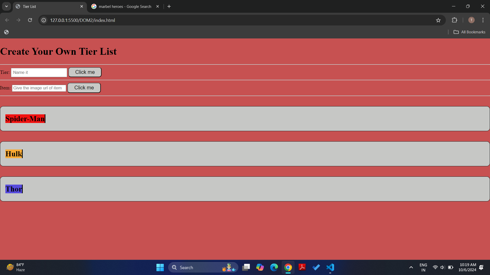
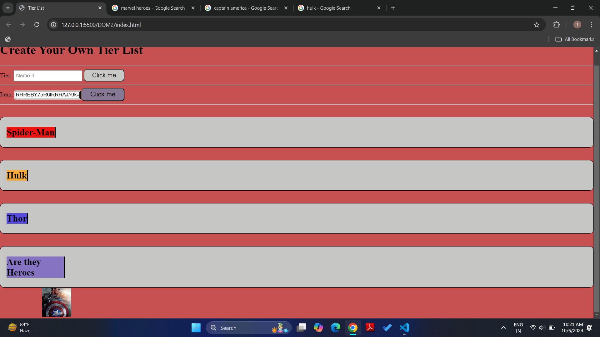
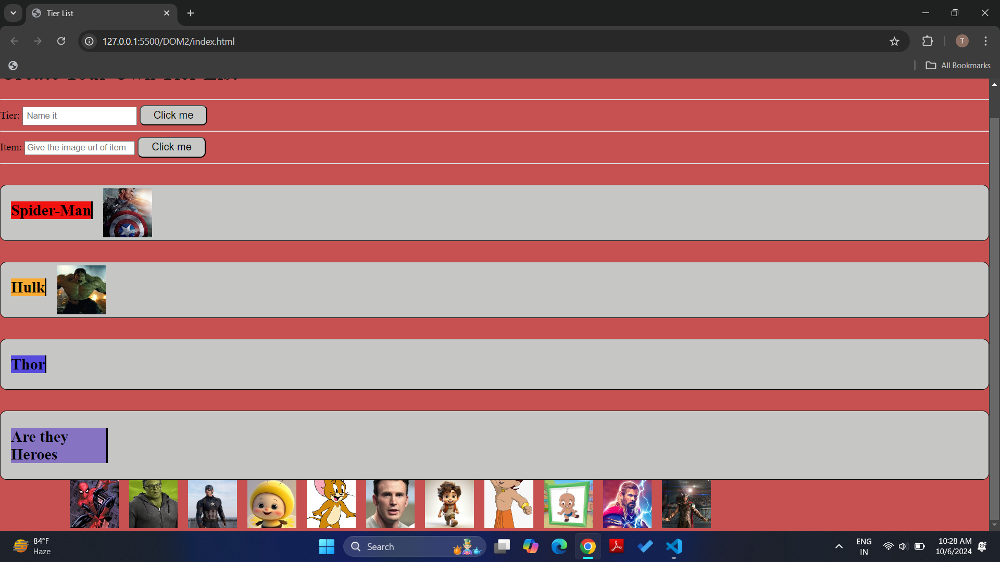
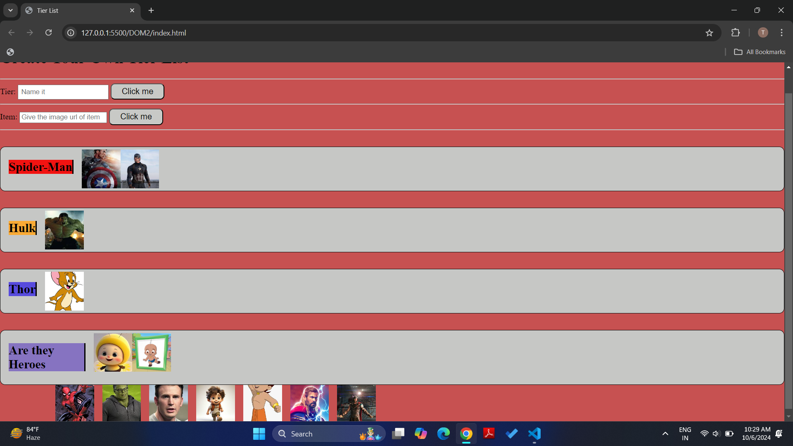
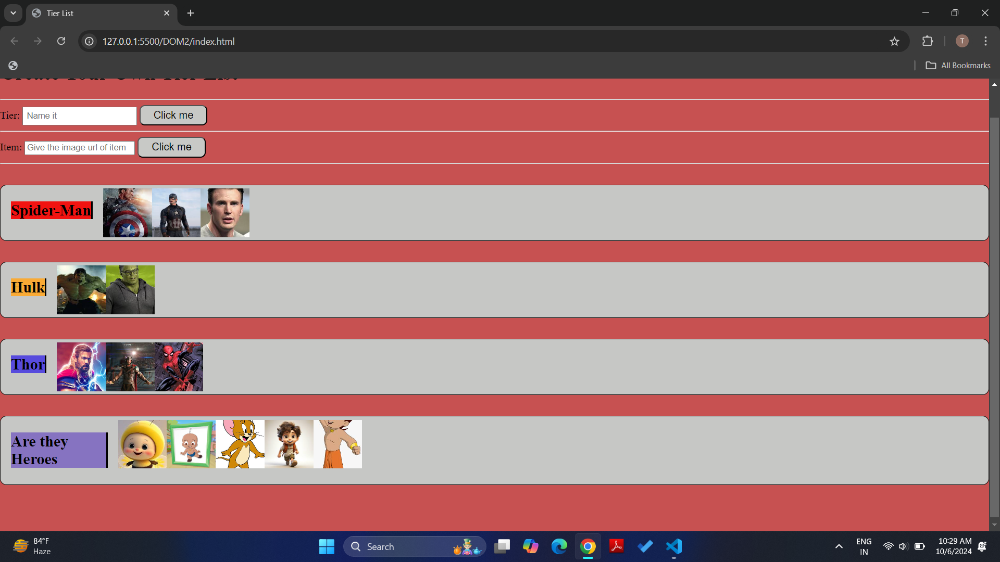
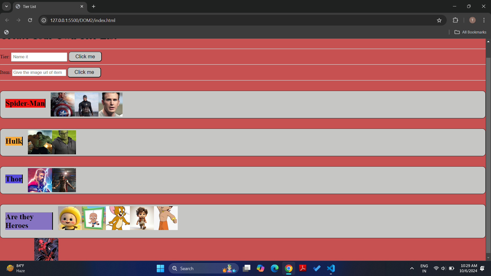

This project is a Tier List application using HTML,CSS and JAVASCRIPT that allows users to rank items into different tiers. It provides a simple and intuitive interface to drag and drop items into categories such as S-tier, A-tier, and so on. 
This can be useful for creating personalized rankings for games, movies, or any other subject where you need to sort and categorize items.

Features:
Drag and Drop: Easily move items between tiers by dragging and dropping them.
Customizable Tiers: Add tiers as per your preference.

Here’s a preview of the Tier List app:

